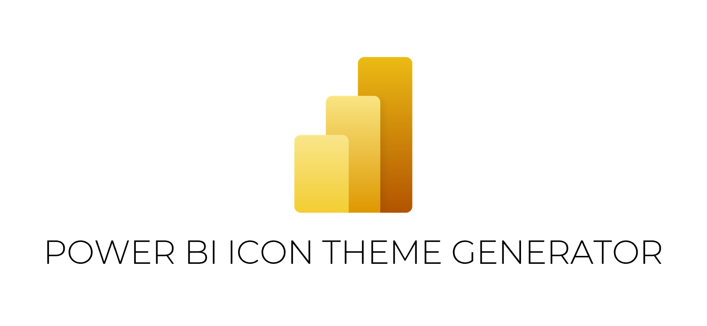

# Power BI Icon Creator - Power BI Theme Icon Generator 🟡🟦🔺



[](https://buymeacoffee.com)


> A simple tool to embed PNG icons into Power BI `.json` theme files through a user-friendly GUI.

---

## 📦 Description

**Power BI Icon Creator** is a lightweight Python GUI tool that helps you add or replace icon definitions in Power BI theme `.json` files.

- It converts PNG images into Base64 strings.
- Adds them to a `"icons"` section in the JSON.
- Leaves all other sections (like `"visualStyles"` and `"dataColors"`) untouched.

---

## ✨ Features

- ✅ Add and embed PNG icons into Power BI theme JSON files  
- 🆕 Generate a new JSON file with your selected icons  
- ✏️ Replace only the `"icons"` section of an existing JSON file  
- 🎨 Keep all other theme settings intact  
- 🖥️ Clean, intuitive GUI built using `tkinter`

---

## 🛠 Installation

Make sure Python 3.x is installed.

1. **Clone this repository**

```bash
git clone https://github.com/YourUsername/PowerBIIconCreator.git
cd PowerBIIconCreator
```

2. **(Optional) Set up a virtual environment**

```bash
python -m venv venv
venv\Scripts\activate        # Windows
# or
source venv/bin/activate     # macOS/Linux
```

3. **Install dependencies**

```bash
pip install -r requirements.txt
```

---

## 🚀 Usage

You can launch the app in two ways:

### ▶️ Run with Python

```bash
python jsonmaker.py
```

### 🖱 Run as Executable

If you've already compiled it, just double-click `jsonmaker.exe`.

---

## 🖼 How to Use the App (UI Walkthrough)

1. **➕ Add PNG Images**  
   Click to select one or more PNG files you want to embed.

2. **🗂 Generate New JSON**  
   Creates a new `.json` file with only your selected icons and their base64 values.

3. **✏️ Edit Existing JSON**  
   Opens an existing theme file, deletes its `"icons"` section (if present), and inserts your selected images instead.  
   Everything else (visual styles, data colors, etc.) stays untouched.

---

## 📁 Folder Structure

```
PowerBIIconCreator/
├── assets/
│   └── logo.png              # Displayed in the UI
├── jsonmaker.py              # Main Python application
├── jsonmaker.exe             # (Optional) Executable file if built with PyInstaller
├── requirements.txt
└── README.md
```

---

## 🤝 Contributing

Contributions are welcome — whether it's fixing a bug, improving the UI, or suggesting new features.

---

## 📜 License

This project is licensed under the MIT License.  
© 2025 [SixSigmaEngineer](https://github.com/SixSigmaEngineer)
